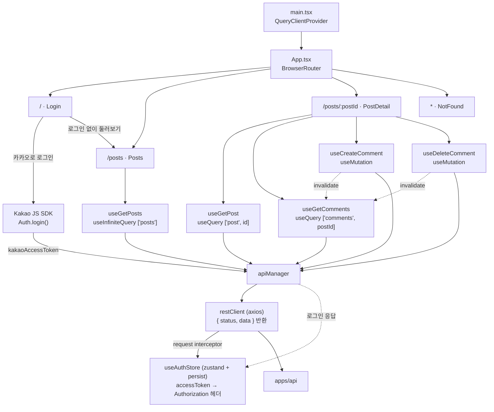
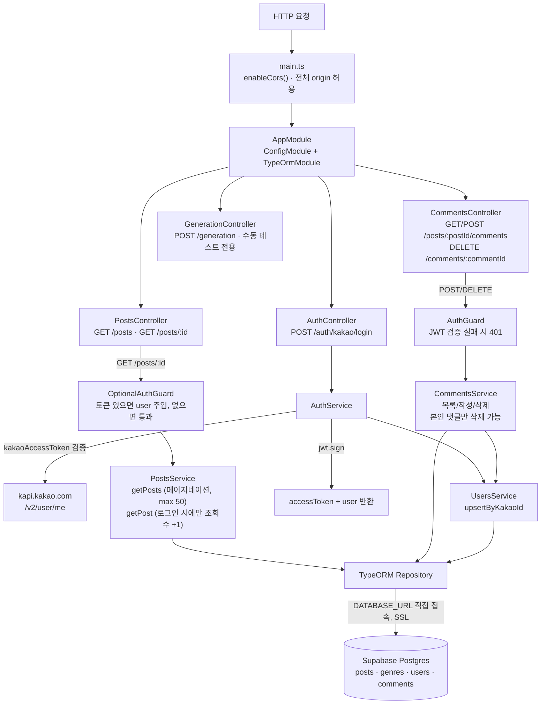
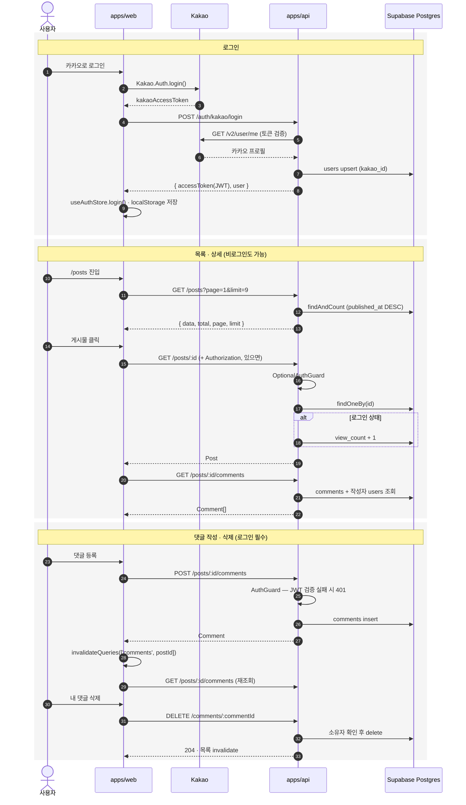
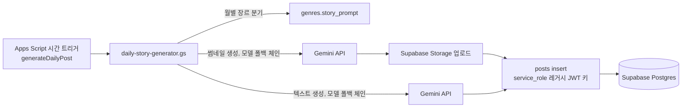

# 플로우차트

DB 구조는 [apps/api/ERD.md](./apps/api/ERD.md) 참고.

## 프론트엔드 (apps/web)

핵심: 인증 상태는 `useAuthStore` 한 곳에만 있고, `restClient` 인터셉터가 매 요청에 JWT를 붙인다. 컴포넌트는 토큰을 직접 다루지 않는다. 비로그인도 목록/상세는 볼 수 있다.

## 백엔드 (apps/api)

핵심: 인증은 `AuthGuard` / `OptionalAuthGuard` 두 개로 끝. 조회수는 로그인 사용자 요청에만 증가한다. PostgREST가 아니라 `DATABASE_URL`로 직접 붙으므로 RLS 대상이 아니다.

## 프론트 ↔ 백엔드 호출 흐름

| 화면 / 동작 | 훅 | 엔드포인트 | 인증 |
|---|---|---|---|
| 로그인 | — (`apiManager.kakaoLogin`) | `POST /auth/kakao/login` | 불필요 (카카오 토큰 전달) |
| 목록 | `useGetPosts` | `GET /posts?page&limit` | 불필요 |
| 상세 | `useGetPost` | `GET /posts/:id` | 선택 — 있으면 조회수 +1 |
| 댓글 목록 | `useGetComments` | `GET /posts/:postId/comments` | 불필요 |
| 댓글 작성 | `useCreateComment` | `POST /posts/:postId/comments` | 필수 |
| 댓글 삭제 | `useDeleteComment` | `DELETE /comments/:commentId` | 필수 (본인 것만) |

핵심: 모든 요청의 `Authorization` 헤더는 `restClient` 인터셉터가 `useAuthStore`에서 꺼내 자동으로 붙인다. 뮤테이션은 응답을 직접 캐시에 넣지 않고 `invalidateQueries`로 재조회한다.

## 일일 생성 (apps/api 미경유)

운영 크론은 Apps Script가 전부 처리한다 — apps/api가 떠 있을 필요 없음.
