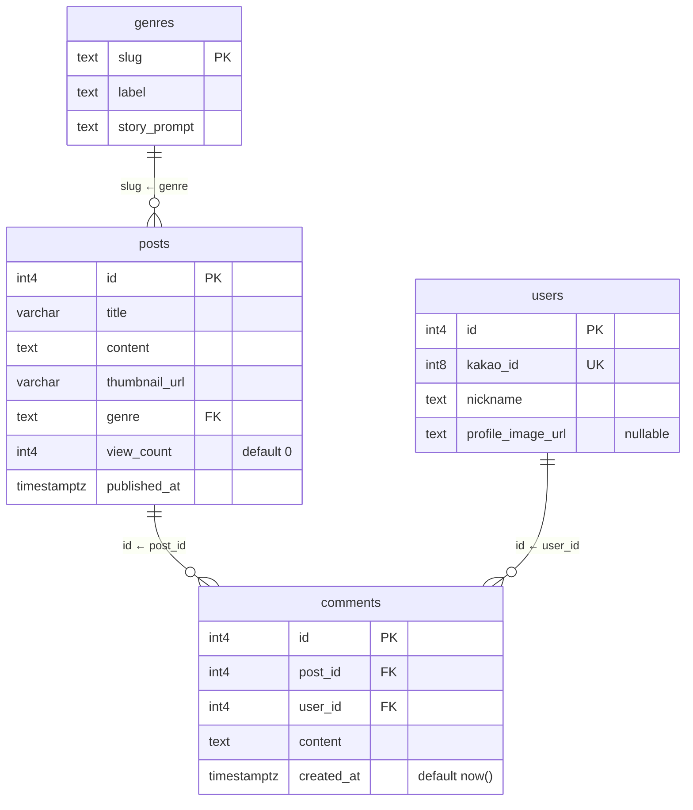

# DB ERD

원본: `supabase/schema.sql`, `apps/api/src/*/entities/*.entity.ts`

```mermaid
erDiagram
    genres ||--o{ posts : "slug ← genre"
    posts  ||--o{ comments : "id ← post_id"
    users  ||--o{ comments : "id ← user_id"

    genres {
        text slug PK
        text label
        text story_prompt
    }
    posts {
        int4 id PK
        varchar title
        text content
        varchar thumbnail_url
        text genre FK
        int4 view_count "default 0"
        timestamptz published_at
    }
    users {
        int4 id PK
        int8 kakao_id UK
        text nickname
        text profile_image_url "nullable"
    }
    comments {
        int4 id PK
        int4 post_id FK
        int4 user_id FK
        text content
        timestamptz created_at "default now()"
    }
```
